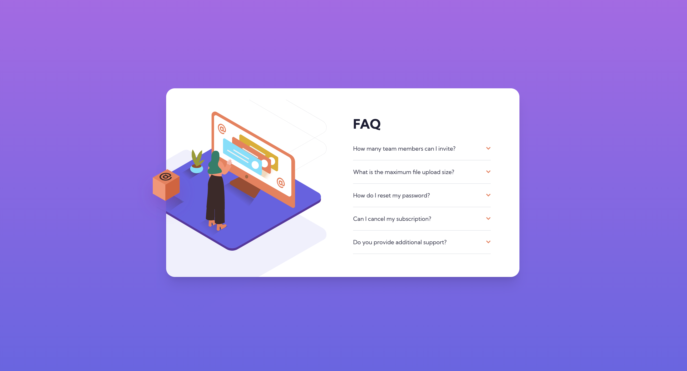

# Frontend Mentor - FAQ accordion card solution

This is a solution to the [FAQ accordion card challenge on Frontend Mentor](https://www.frontendmentor.io/challenges/faq-accordion-card-XlyjD0Oam). Frontend Mentor challenges help you improve your coding skills by building realistic projects.

## Table of contents

- [Overview](#overview)
  - [The challenge](#the-challenge)
  - [Screenshot](#screenshot)
  - [Links](#links)
- [My process](#my-process)
  - [Built with](#built-with)
  - [What I learned](#what-i-learned)
  - [Continued development](#continued-development)
  - [Useful resources](#useful-resources)
- [Author](#author)
- [Acknowledgments](#acknowledgments)

## Overview

### The challenge

Users should be able to:

- View the optimal layout for the component depending on their device's screen size
- See hover states for all interactive elements on the page
- Hide/Show the answer to a question when the question is clicked

### Screenshot



### Links

- Solution URL: [Add solution URL here](https://your-solution-url.com)
- Live Site URL: [Add live site URL here](https://your-live-site-url.com)

## My process

### Built with

- Semantic HTML5 markup
- CSS custom properties
- Flexbox
- CSS Grid
- Mobile-first workflow
- [React](https://reactjs.org/) - JS library
- [Tailwind](https://https://tailwindcss.com//) - CSS framework

```js
function Accordion() {
  const [open, setOpen] = useState(null);

  const toggle = (index) => {
    if (open === index) {
      setOpen(null);
    } else {
      setOpen(index);
    }
  };

  return (
    <>
      {accordionData.map((data, index) => (
        <div key={index} className="text-left">
          <div
            className="flex items-center justify-between cursor-pointer accordion-item"
            onClick={() => toggle(index)}
          >
            <h3 className={`my-5 ${open === index ? "font-bold mb-0" : ""}`}>
              {data.title}
            </h3>
            <div>
              {open === index ? (
                
              ) : (
                
              )}
            </div>
          </div>
          {open === index && (
            <p className="my-5" style={{ color: "var( --darkGrayishBlue)" }}>
              {data.desc}
            </p>
          )}
          <hr />
        </div>
      ))}
    </>
  );
}
```

## Author

- Website - [Lorena Rincón](https://github.com/lorenacrincon)
- Frontend Mentor - [@lorenacrincon](https://www.frontendmentor.io/profile/lorenacrincon)
